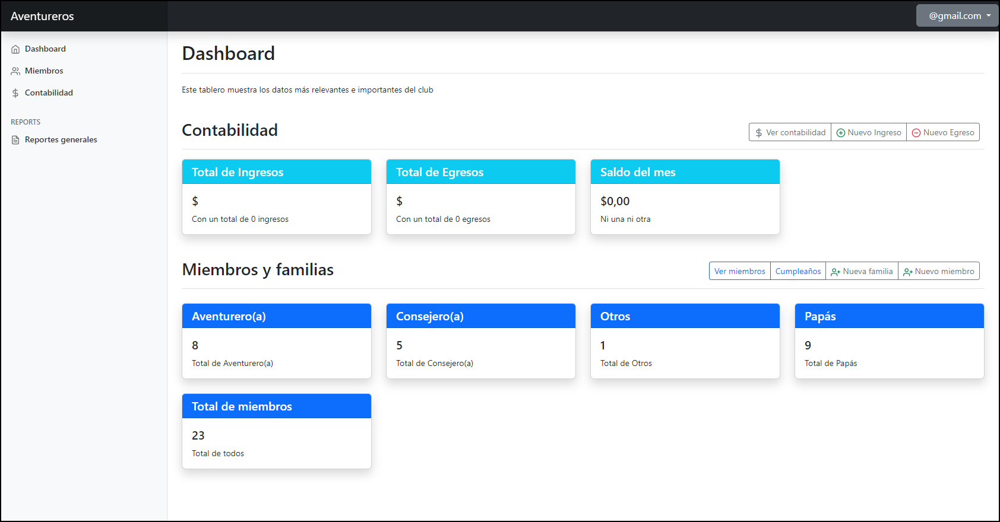

# gestion-club-iasd




Este es un proyecto para la gestión de los clubes de la **Iglesia Adventista del Séptimo Día**, y tiene las siguientes funciones:

- Modulo de gestión de los integrantes o miembros del club
  - Control de las familias
  - Control de los miembros del club (aventurero, papas, consejeros, etc....)
  - Calendario de cumpleaños

- Control contable de los ingresos (entradas) o egresos (salidas) que tiene el club
  - Mantiene un control de los ingresos o donativos que ha recibido el club
  - Registra todos los egresos (salidas) de dinero que ha tenido el club
  - Mantiene una contabilidad anual y mensual de lo que sale y entra al club


Este proyecto fue creado para ayudar a la gestión y administración de un club.


---

Este es un proyecto basado en la estructura de [djangox](https://github.com/wsvincent/djangox)

> A batteries-included Django starter project. To learn more try the books [Django for Beginners](https://djangoforbeginners.com), [Django for APIs](https://djangoforapis.com), and [Django for Professionals](https://djangoforprofessionals.com).

## 🚀 Features

- Django 4.1 & Python 3.11
- Bootstrap 5.2.3
- Install via [Pip](https://pypi.org/project/pip/) or [Docker](https://www.docker.com/)
- User log in/out, sign up, password reset via [django-allauth](https://github.com/pennersr/django-allauth)
- Static files configured with [Whitenoise](http://whitenoise.evans.io/en/stable/index.html)
- Styling with [Bootstrap v5](https://getbootstrap.com/)
- Debugging with [django-debug-toolbar](https://github.com/jazzband/django-debug-toolbar)
- DRY forms with [django-crispy-forms](https://github.com/django-crispy-forms/django-crispy-forms)


----


## Deployment :rocket:

### Docker

Es necesario ejecutar estas instrucciones en el contenedor

```shell
$ docker exec -it gestion-aventureros-web-1 python manage.py migrate
$ docker exec -it gestion-aventureros-web-1 python manage.py collectstatic
```

Para crear un usuario administrador

```shell
$ docker exec -it gestion-aventureros-web-1 python manage.py createsuperuser
```


## Configuración

Estas son las variables de ambiente (env) que se requieren para levantar el servicio

```
DJANGO_SECRET_KEY="cadena secreta"
DJANGO_DEBUG=False
DJANGO_ALLOWED_HOSTS=*
DJANGO_DATABASE_TEST=False
DJANGO_TIME_ZONE="America/Mexico_City"
DJANGO_CSRF_TRUSTED_ORIGINS="https://subdominio.dominio.com"
```

